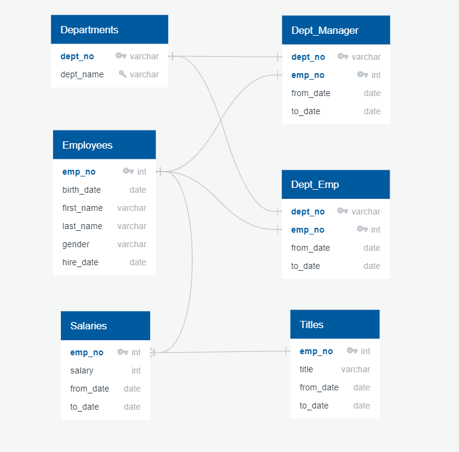
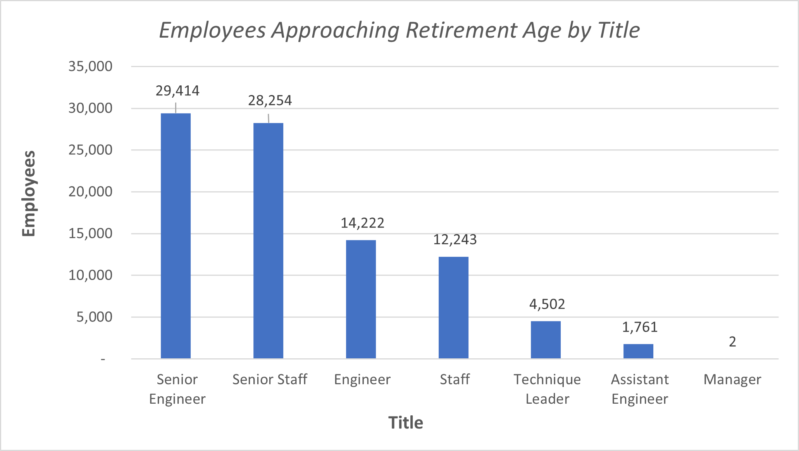

# Pewlett-Hackard-Analysis

## Project Overview

Using the separate csv files containing employee data, create a SQL database to analyze the impact of many current employees reaching retirement age (i.e. the "silver tsunami"). 

## Resources

- Data Sources: departments.csv, dept_emp.csv, dept_manager.csv, employees.csv, salaries.csv, titles.csv
- Software: postgresql-11.13, VSCode 1.60

## Results
Below is a summary of the analysis:

* The database was successfully created to perform the analysis. An illustration of the schema behind the joining of the separate csv files can be found below:

* Of the 300,024 total employees, 90,398 are approaching retirement age (approximately 30% of total employees).

* The job titles with the most number of employees approaching retirement are Senior Engineer & Senior Staff.  An illustration of all employees approaching retirement age by current job title can be found below:

* Of the 90,398 employees approaching retirement age, 1,549 of them are eligible for mentorship.

## Summary

### How many roles will need to be filled as the "silver tsunami" begins to make an impact?

As illustrated in the bar chart above, approximately 90,398 roles across 7 different job titles will need to be filled.

### Are there enough qualified, retirement-ready employees in the departments to mentor the next generation of Pewlett Hackard employees?

Currently there are only 1,549 employees that qualify for mentorship. Pewlett-Hackard should consider ways to expand the pool of mentors (e.g. lower the age of eligibiity). 
